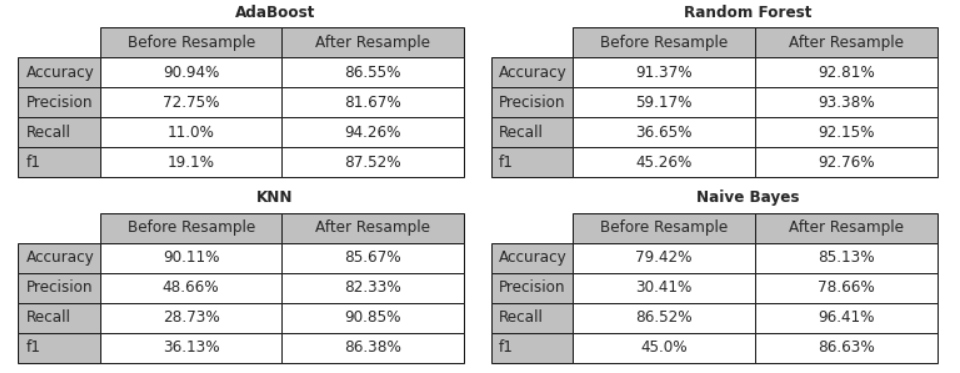
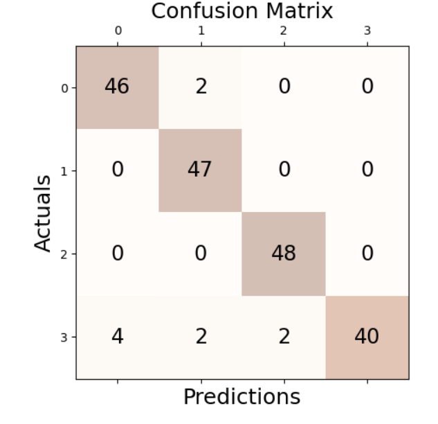

## Overview
This repository contains different Machine Learning Projects.

## Project 1
### Asteroid Threat Detection
This project focuses on predicting whether an asteroid is potentially hazardous to Earth using machine learning classification models. The dataset contains asteroid characteristics such as diameter, velocity, miss distance, and brightness (absolute magnitude).

### Dataset
- Dataset can be found from kaggle [here](https://www.kaggle.com/datasets/sameepvani/nasa-nearest-earth-objects)
- Dataset Size: 90,836 rows × 10 columns

### Data Preprocessing
- Dropped irrelevant columns (id, name, orbiting_body, sentry_object)
- Encoded categorical labels
- Normalized features (Box-Cox transformation)
- Removed outliers via Z-score
- Imputed missing values with KNN Imputer

### Handling Imbalance
- Class imbalance addressed with SMOTE oversampling
  
### Feature Scaling
- Standardized numerical features using StandardScaler
  
### Models Implemented
- AdaBoost
- Random Forest
- K-Nearest Neighbors (KNN)
- Gaussian Naive Bayes
  
### Evaluation Metrics
- Accuracy
- Precision
- Recall
- F1-Score
- Confusion Matrix
  
### Results

Random Forest (After SMOTE) is the best model with balanced accuracy and precision/recall.

## Project 2
### Prediction of Genetic Mutation from Clinical Data of Cystic Fibrosis using Few-Shot Siamese Bidirectional LSTM

Cystic Fibrosis (CF) is a life-threatening genetic disorder caused by mutations in the CFTR gene. Early and accurate prediction of genetic mutations based on clinical features can significantly improve diagnosis and personalized treatment planning.

This project builds a Few-Shot Siamese BiLSTM model to predict genetic mutations in CF patients using clinical data. The pipeline involves extensive preprocessing, feature engineering, balancing imbalanced data, and training deep learning architectures designed for low-data regimes.

### Dataset

- Total Records: 208 patients
- Features: 20 clinical variables including:

    - Clinical Diagnosis: Neonatal Screening (NBS), Meconium Ileus (MI), DIOS, Sweat Chloride at Diagnosis

    - Pulmonary Measures: FEV1%, severe lung disease status

    - Infections: P. Aeruginosa, MRSA, S. Aureus, B. Cepacia, etc.

    - Comorbidities: CF Liver Disease, CF-Related Diabetes (CFRD), Nasal Polyposis (NP)

    - CFTR Genotype (Target)

### Data Preprocessing
1. Handling Missing Data

    - Categorical values imputed using most frequent strategy

    - Continuous values imputed with KNNImputer (k=5)

    - Converted categorical disease markers (e.g., NBS, MI, DIOS) into binary encoding

2. Feature Engineering

    - Combined multiple FEV1% columns into a single averaged column

    - Outlier detection using z-score filtering

    - Standardized categorical encodings for CF-related comorbidities

3. Target Label Engineering

    - Mutations simplified into 4 categories:

    - F508del/F508del → 0

    - F508del/G542X → 1

    - F508del/N1303K → 2

    - Other → 3

4. Balancing the Dataset

    - Original dataset was imbalanced (Other mutations dominated)

    - Applied SMOTE (Synthetic Minority Oversampling Technique) to ensure balanced class distribution.

### Model Architecture

- Few-Shot Siamese Network with Bidirectional LSTM encoders.

- Input: Patient clinical feature vectors.

- Output: Genetic mutation class similarity.

- Loss: Contrastive / triplet loss for similarity learning.

### Results

- Balanced dataset improved prediction stability across minority classes.

- BiLSTM Siamese network demonstrated strong generalization in mutation prediction under few-shot settings.

- Correlation analysis highlighted key features (e.g., Sweat Chloride, FEV1%, P. Aeruginosa colonization, CFRD).

